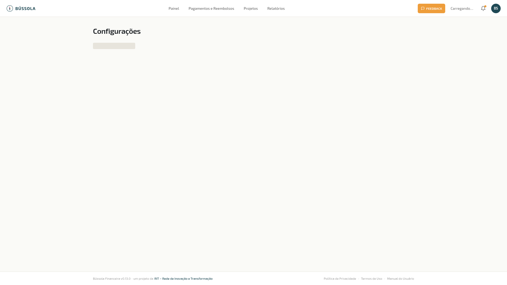

> Disponível para **Presidente (admin)** e **Tesoureiro**.

A página **Contas Bancárias** lista as contas financeiras da sua OSC e permite cadastrar novas, editar dados existentes e desativar contas que saíram de uso.

*Configurações — Contas financeiras*

> 💡 **Por que isso importa**
> "Conta financeira" no Bússola não é só **conta bancária**. É qualquer lugar onde a OSC guarda dinheiro: a conta corrente do banco, a poupança, o caixa interno em dinheiro vivo, o cartão de crédito da OSC, a conta no Mercado Pago para recebimentos online, o saldo no PayPal. Cada um desses é uma "conta" diferente, e mantê-los separados no Bússola **faz a contabilidade bater com a realidade** — você sabe quanto tem em cada lugar, e o saldo total consolidado reflete a posição real da OSC.

## Tipos de conta suportados

- **Corrente** — conta bancária de uso geral
- **Poupança** — conta poupança vinculada
- **Investimento** — aplicações, CDB, fundos
- **Dinheiro** — caixa interno físico (notas e moedas guardadas na sede)
- **Cartão de crédito** — conta-cartão (saldo negativo)
- **Cartão de débito** — quando há saldo pré-pago vinculado
- **Outro** — para casos não cobertos (PayPal, Mercado Pago, gateway de pagamento, etc.)

## Adicionar nova conta

Clique em **+ Nova conta**. Preencha:

- **Nome** — descritivo (ex: "Banco do Brasil — CC", "Mercado Pago — Vendas WC")
- **Tipo** — da lista acima
- **Banco** — quando aplicável
- **Saldo inicial** — quanto tem na conta no momento do cadastro
- **Data de abertura** — quando a conta começou a ser usada pela OSC (não a data de criação no Bússola)

> 📖 **Conceito · Saldo inicial e data de abertura**
> Quando você cadastra uma conta nova na Bússola, ela precisa saber qual era o saldo no momento em que sua OSC começou a usá-la no sistema. **Não é o saldo de hoje** — é o saldo na data de abertura. A Bússola usa esse valor como ponto de partida para calcular saldos futuros somando receitas e subtraindo despesas pagas. Se você está migrando de planilha para o Bússola, **a data de abertura é o dia que você começa a registrar no Bússola**, e o saldo inicial é o que estava na conta naquele dia.

## Ações por conta

- **Editar** — alterar nome, banco, tipo (não o saldo — saldo só muda via movimentações)
- **Desativar / Reativar** — uma conta desativada não aparece em filtros e formulários, mas seu histórico permanece preservado

> ⚠️ **Atenção · Conta com movimentações não pode ser excluída**
> A Bússola **não permite excluir conta que tem movimentações registradas** — só desativar. Motivo: excluir destruiria a história contábil dessas movimentações ("essa receita foi para qual conta?"). Para "encerrar" uma conta na prática, **desative**. As movimentações ficam intactas no histórico, e a conta desativada não aparece nos formulários de novo lançamento.

## Saldo em tempo real

Cada conta na lista mostra o **saldo atual**, calculado em tempo real a partir das movimentações pagas. Quando você marca uma receita ou despesa como paga em Movimentações, o saldo aqui atualiza imediatamente.

> ✓ **Dica · Concilie mensalmente contra o extrato bancário**
> No final de cada mês, abra o extrato do banco e o saldo da conta correspondente aqui na Bússola. Eles devem bater **centavos por centavos**. Diferenças apontam para lançamento esquecido, valor digitado errado, ou taxa que não foi registrada. Corrigir mensalmente é fácil; descobrir 6 meses depois é pesadelo.

## Por onde seguir

- **Movimentações** — onde as contas aparecem como destino/origem dos lançamentos.
- **Painel** — onde os saldos consolidados das contas ativas aparecem.
- **Configurações → Organização → Integrações → WooCommerce** — onde você define qual conta recebe receitas da loja online.
