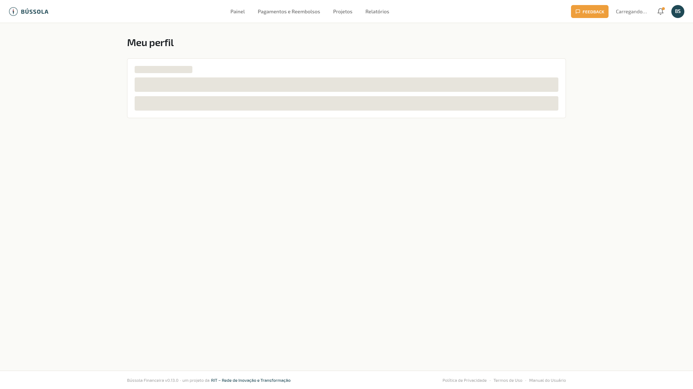

A página **Meu Perfil** concentra **seus** dados pessoais e preferências dentro do Bússola — não os dados da organização. Disponível para todos os usuários autenticados, acessada pelo menu do avatar (canto superior direito → **Meu perfil**) ou diretamente pela rota `/perfil`.

*Página Meu Perfil — 4 boxes consolidados*

> 💡 **Por que isso importa**
> Perfil bem configurado tem dois efeitos práticos: (1) **reembolsos mais rápidos** porque a chave PIX/TED já vem pré-preenchida; (2) **menos ruído no dia a dia** porque você só recebe as notificações que importam para você, nos canais que prefere. 5 minutos de configuração inicial economizam horas ao longo dos meses.

A página tem 4 boxes consolidados.

## Identificação

- **Foto de perfil** — JPG, PNG ou WebP, até 2 MB. A imagem é redimensionada para 512×512 antes do envio.
- **Nome completo** — como aparece em audit logs, aprovações, registros.
- **Telefone** — formato internacional (com `+55`).
- **Data de nascimento** — opcional.
- **CPF** e **RG** — opcionais; armazenados **cifrados em repouso** (chave de criptografia gerenciada separadamente do banco). Usados apenas para emissão de comprovantes quando exigido por lei.

Botão **Salvar alterações** ao final do box salva tudo de uma vez.

> ⚠️ **Atenção · CPF e RG são dados sensíveis pela LGPD**
> Você só precisa preencher CPF/RG se a sua OSC vai emitir documento que exija (recibo formal, declaração para imposto de renda, etc.). Se você não tem certeza se precisa, deixe em branco — a Bússola não exige esses dados para operar.

## Dados para Reembolso

Configure aqui sua **chave PIX** ou **dados bancários para TED**. Quando você criar um Reembolso, a Bússola preenche automaticamente esses dados — você não precisa redigitar a cada solicitação, e não corre risco de errar a chave.

> ✓ **Dica · Use chave PIX preferencialmente**
> PIX simplifica a vida do tesoureiro: pagamento imediato, sem custo, sem necessidade de TED programada. Se sua conta tem chave PIX configurada, use-a aqui em vez dos dados bancários completos. A OSC paga mais rápido, você recebe mais rápido.

Se você nunca pede reembolso, pode deixar em branco — só preencha quando for fazer a primeira solicitação.

## Notificações

Dois grupos de configuração:

### Canais de notificação

- **Número de WhatsApp** — para receber alertas. Formato internacional (`+5511999999999`).
- **Telegram** — vinculação via bot. Envie `/start` para `@BussolaBot` no Telegram para vincular seu Telegram à sua conta Bússola. O campo aqui aparece como "Não vinculado" até você fazer a vinculação pelo bot.

E-mail é o canal default — sempre disponível, sem configuração adicional.

### Matriz granular de preferências

Tabela com **10 eventos × 3 canais** permite controle fino sobre quais notificações receber e por onde:

**Reembolsos** (5 eventos): submetido, aprovação parcial, aprovado, rejeitado, pago.
**Pedidos de Pagamento** (5 eventos): submetido, aprovação parcial, aprovado, rejeitado, pago.

Para cada par (evento, canal), um switch on/off. **Default é tudo ligado** — você silencia o que não quer receber.

> 📖 **Conceito · Canal desabilitado vs canal não cadastrado**
> Se a coluna WhatsApp ou Telegram aparece **desabilitada** com tooltip ("Cadastre seu número primeiro"), é porque você ainda não preencheu o contato. Cadastre o número/vincule o bot acima e salve — na próxima abertura da página, a coluna fica habilitada para escolher quais eventos receber por esse canal.

> ✓ **Dica · Calibre por papel**
> Se você é aprovador, mantenha "submetido" ligado para ser avisado quando um reembolso/pedido precisa do seu voto. Se você é solicitante e não aprovador, "submetido" não te interessa — pode desligar e manter só "aprovado", "rejeitado" e "pago". Tesoureiro deve manter "aprovado" e "pago" sempre ligados para acompanhar o ciclo de pagamento.

## Ações de Conta

Ações administrativas sobre sua própria conta, cada uma com botão independente:

- **Alterar senha** — campos de nova senha e confirmação; clique em "Alterar senha" para confirmar. Senha forte (8+ caracteres, mix de letras, números e símbolos) é exigida.
- **Encerrar todas as sessões** — desconecta sua conta de todos os dispositivos onde está logada. Útil se você perdeu acesso a um celular ou suspeita de uso indevido.
- **Solicitar exclusão de dados (LGPD)** — abre fluxo para exercer o direito ao esquecimento previsto na Lei Geral de Proteção de Dados. A exclusão tem regras específicas (dados financeiros têm retenção legal mínima); o fluxo orienta o que pode e o que não pode ser excluído.

> ⚠️ **Atenção · Encerrar sessões te desconecta também**
> "Encerrar todas as sessões" inclui o navegador atual. Você vai precisar fazer login de novo. Útil principalmente em situação de risco (perdeu celular, suspeita de acesso indevido). Em uso normal, não há motivo para usar.

## Por onde seguir

- **Reembolsos** — onde os dados de reembolso configurados aqui são usados automaticamente.
- **Configurações → Usuários** — para o admin gerenciar acesso de outros membros.
