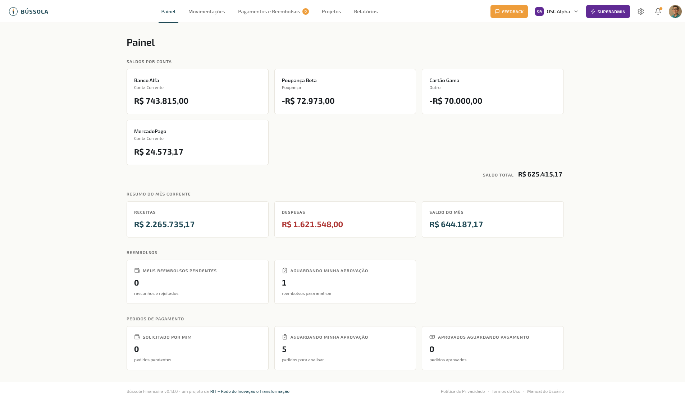

O **Painel** é a primeira tela após o login — a visão de cockpit da sua OSC. Em uma única página você vê quanto dinheiro tem disponível, o resumo do mês corrente e os atalhos para as pendências que precisam da sua atenção naquele momento, ajustados ao seu papel.

*Painel principal*

> 💡 **Por que isso importa**
> A maioria das ferramentas financeiras te despeja em uma lista enorme de lançamentos no login. O Painel inverte isso: **mostra primeiro o que importa para você decidir o próximo passo** — saldo, resumo, pendências por papel. Tesoureiro vê quantos reembolsos esperam pagamento; presidente vê pedidos aguardando aprovação; voluntário vê seus próprios reembolsos pendentes. Resultado: você gasta menos tempo procurando informação, mais tempo decidindo.

## Saldos por conta

Bloco com cada conta financeira da OSC (corrente, poupança, cartão, caixa interno, etc.) e o **saldo atual** de cada uma. No rodapé, o **saldo consolidado** soma todas as contas ativas.

> 📖 **Conceito · Como o saldo é calculado**
> O saldo é calculado em tempo real a partir das movimentações financeiras: soma de receitas pagas menos despesas pagas, considerando o saldo inicial da conta. **Movimentações pendentes não entram no saldo** — só somam quando você marca como pagas. Isso bate com a realidade do extrato bancário: o que você tem hoje é o que efetivamente entrou e ainda não saiu, não o que está previsto.

## Resumo do mês corrente

Três cards rápidos com:

- **Receitas** do mês — total de receitas com data de pagamento no mês atual
- **Despesas** do mês — total de despesas com data de pagamento no mês atual
- **Saldo do mês** — diferença entre as duas

Útil para responder de relance: "como foi o mês até agora?"

## Cards de Reembolsos e Pedidos de Pagamento

A partir daqui, o que aparece depende do seu papel — você só vê pendências relacionadas ao que pode resolver.

### Reembolsos

- **Meus reembolsos pendentes** — rascunhos e rejeitados aguardando reenvio (todos os papéis veem os próprios)
- **Aguardando minha aprovação** — somente para aprovadores elegíveis (Presidente, Tesoureiro e quem mais a OSC configurar)

### Pedidos de Pagamento

- **Solicitado por mim** — seus próprios pedidos pendentes (todos os papéis veem os próprios)
- **Aguardando minha aprovação** — somente para aprovadores elegíveis
- **Aprovados aguardando pagamento** — somente para o tesoureiro

Clicar em qualquer card leva direto à lista filtrada pelo status correspondente — atalho rápido para "resolver pendência agora".

> ✓ **Dica · Use o Painel como rotina de manhã**
> 5 minutos no Painel todo dia (ou toda segunda de manhã) substituem 1 hora de garimpo no final do mês. **Olhe saldo, leia pendências, decide o que precisa decidir, fecha.** Em OSC bem gerida, o Painel não tem cards com números altos parados ali há semanas — pendência só fica parada quando ninguém olhou.

## Por onde seguir

- **Movimentações** — para registrar novas entradas/saídas ou conferir movimentos do período.
- **Pagamentos e Reembolsos** — para resolver as pendências marcadas nos cards.
- **Meu Perfil → Notificações** — para receber alerta quando uma pendência sua aparecer (em vez de depender de abrir o sistema).
